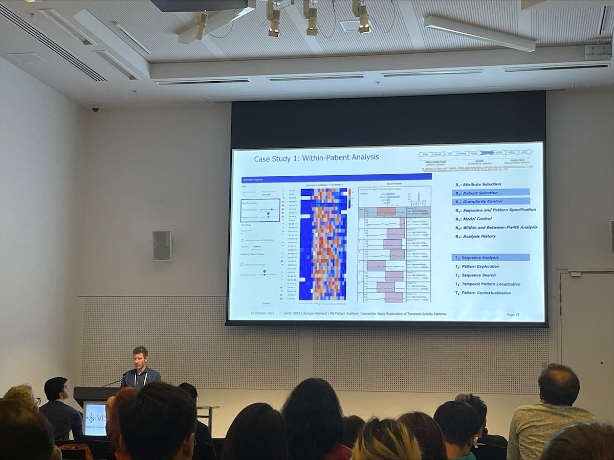

Title: Workshop Event
Category: 2023
Date: 2023-10-24
Slug: workshop-event
Authors: VAHC Committee
Summary: VAHC 2023 Workshop Event

# Best Paper Award

Contratulations to Sarah Goodwin, Thom Saunders, Joanne Aitken, Peter Baade, Upeksha Chandrasiri, Dianne Cook, Susanna Cramb, Earl Duncan, Stephanie Kobakian, Jessie Roberts, and Kerrie Mengersen in recognition of their outstanding contribution **"Designing the Australian Cancer Atlas: Visualising Geostatistical Model Uncertainty for Multiple Audiences"**

 

# Best Poster Award

Contratulations to Masaki Uchihara, Akiyo Tanabe, Hiroshi Kajio in recognition of their outstanding contribution **"Clinical Issues and Suggestions: Dashboard Visualization of the Trajectory of Patients with Malignant Hormone Producing Tumors for Precision Medicine"**

 

# Panel: Interactive Visualization of Health Data for Digital and Personal Health

Special thanks to our five panelists Quang Vinh Nguyen, Simon D'Alfonso, Levin Kuhlmann, Silvia Miksch, and Nils Gehlenborg, it was a pleasure to have you at the VAHC!

 

# Paper Session

Thanks to the many attendees of the VAHC workshop. Here: **MS Pattern Explorer: Interactive Visual Exploration of Temporal Activity Patterns**, by Yves Rutishauer, Gabriela Morgenshtern, Christina Haag, Viktor von Wyl, and Jürgen Bernard, presented by Jürgen Bernard 

 
